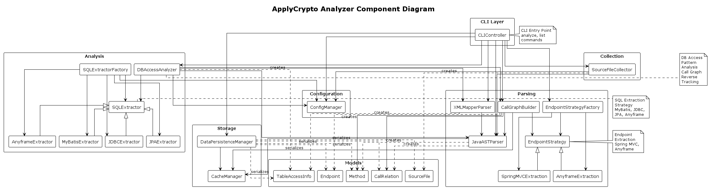
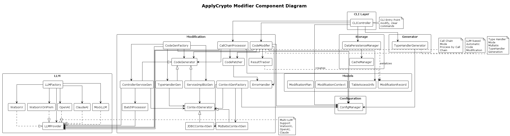

# AI 서비스 정의서
## 삼성생명 AI활용 개인정보 암호화 적용

---

## 문서 정보
- **문서명**: AI 서비스 정의서 <삼성생명 AI활용 개인정보 암호화 적용>
- **문서 유형**: 공식 프로젝트 산출물
- **프로젝트명**: ApplyCrypto - Java Spring Boot 암호화 자동 적용 도구
- **버전**: 1.0
- **작성일**: 2026-03-16
- **작성자**: ApplyCrypto 개발팀
- **승인자**: [승인자명]
- **배포 대상**: 프로젝트 팀, 이해관계자

## 목차

### 1. [시스템 개요](#1-시스템-개요)
   - AI 활용 개인정보 암호화 서비스의 시스템 아키텍처
   - System Overview Diagram

### 2. [AI 서비스 아키텍처](#2-ai-서비스-아키텍처)
   - 2-1. [AI 서비스 개요](#2-1-ai-서비스-개요)
     - AI 서비스 컴포넌트 다이어그램
     - Analyzer Diagram (상세)
     - Modifier Diagram (상세)
   - 2-2. [주요 컴포넌트](#2-2-주요-컴포넌트)
     - Command Line Interface
     - Configuration Manager
     - Analyzer
     - Modifier
     - Persistence Manager

### 3. [AI 서비스 기능](#3-ai-서비스-기능)
   - 3-1. [Analyze](#3-1-analyze)
     - Endpoint Extractor
     - SQL Extractor
     - Call Graph Builder
     - DB Access Analyzer
   - 3-2. [Modify](#3-2-modify)
     - Context Generator
     - Code Generator
     - Code Patcher
   - 3-3. [Artifacts](#3-3-artifacts)
     - Spec Generator
     - Artifact Generator
     - AS-IS Analysis Generator
     - Endpoint Report Generator
     - KSIGN Call Estimation Generator

### 4. [AI 서비스 실행](#4-ai-서비스-실행)
   - 4-1. [Config 파일 설정](#4-1-config-파일-설정)
   - 4-2. [Analyze 실행 및 결과 저장](#4-2-analyze-실행-및-결과-저장)
   - 4-3. [Modify 실행 및 결과 저장](#4-3-modify-실행-및-결과-저장)
   - 4-4. [Artifacts 실행 및 결과 저장](#4-4-artifacts-실행-및-결과-저장)

### 5. [AI 서비스 개발 표준](#5-ai-서비스-개발-표준)
   - Application 구조 적용을 위한 Configuration
   - 소스 코드 형상 관리 규칙
   - Config 파일 관리 규칙
   - Prompt Template 관리 규칙
   - 코딩 컨벤션

### 6. [암호화 적용 업무 프로세스](#6-암호화-적용-업무-프로세스)
   - 분석/설계
   - 전환/테스트
   - 결함지원
   - 이관산출물 작성

### [부록](#부록)
   - [A. 용어 정의](#a-용어-정의)
   - [B. 참고 문서](#b-참고-문서)

---

## 1. 시스템 개요

### 1.1 AI 활용 개인정보 암호화 서비스

**ApplyCrypto**는 Java Spring Boot 기반 레거시 시스템에서 민감한 개인정보를 데이터베이스에 암호화하여 저장하도록 소스 코드를 자동으로 분석하고 수정하는 AI 기반 개발 도구입니다.

#### 서비스 목적
- 레거시 시스템의 개인정보 암호화 자동 적용
- AI 기반 코드 분석 및 자동 수정
- 개발 생산성 향상 및 오류 최소화
- 규제 준수 (개인정보보호법, GDPR)

#### 핵심 가치
- 🚀 **개발 시간 90% 단축**: 수동 작업 2주 → AI 자동화 1시간
- 💰 **프로젝트 비용 90% 절감**: 6,000만원 → 700만원
- ✅ **오류율 95% 감소**: 5~10% → <1%
- 📊 **ROI 757%**: 투자 대비 높은 효과

#### 적용 대상
- **주 사용자**: 레거시 시스템 유지보수 개발자, 시스템 아키텍트
- **부 사용자**: 보안 담당자, 프로젝트 관리자, QA 엔지니어
- **대상 시스템**: Java Spring Boot 기반 웹 애플리케이션 및 배치 시스템
- **대상 산업**: 금융권 (은행, 증권, 보험), 공공기관, 대기업

### 1.2 System Overview Diagram

#### 전체 시스템 아키텍처

```
┌─────────────────────────────────────────────────────────────────┐
│                      사용자 인터페이스 계층                        │
│  ┌──────────────────────┐      ┌──────────────────────┐        │
│  │   CLI Interface      │      │   Streamlit UI       │        │
│  │  (명령어 기반 실행)    │      │  (웹 기반 대시보드)    │        │
│  └──────────────────────┘      └──────────────────────┘        │
└─────────────────────────────────────────────────────────────────┘
                            ↓
┌─────────────────────────────────────────────────────────────────┐
│                      설정 관리 계층                               │
│                  Configuration Manager                          │
│  - JSON 설정 파일 로드 및 검증                                    │
│  - 프로젝트 경로, 테이블/칼럼 정보 관리                             │
│  - Framework Type, SQL Wrapping Type, Modification Type 설정    │
└─────────────────────────────────────────────────────────────────┘
                            ↓
┌─────────────────────────────────────────────────────────────────┐
│                      분석 계층 (Analyzer)                         │
│  ┌──────────────┐  ┌──────────────┐  ┌──────────────┐         │
│  │   Parser     │  │  Call Graph  │  │ DB Access    │         │
│  │   (AST/XML)  │  │   Builder    │  │  Analyzer    │         │
│  └──────────────┘  └──────────────┘  └──────────────┘         │
│  - Java/XML 파싱  - 호출 관계 분석  - 테이블 접근 추적           │
└─────────────────────────────────────────────────────────────────┘
                            ↓
┌─────────────────────────────────────────────────────────────────┐
│                      수정 계층 (Modifier)                         │
│  ┌──────────────┐  ┌──────────────┐  ┌──────────────┐         │
│  │   Context    │  │     Code     │  │     Code     │         │
│  │  Generator   │  │  Generator   │  │   Patcher    │         │
│  └──────────────┘  └──────────────┘  └──────────────┘         │
│                   (AI 모델 연동)                                 │
│  - WatsonX.AI / Claude AI / OpenAI GPT                         │
└─────────────────────────────────────────────────────────────────┘
                            ↓
┌─────────────────────────────────────────────────────────────────┐
│                      영속화 계층                                  │
│                 Persistence Manager                             │
│  - JSON 직렬화/역직렬화                                           │
│  - 캐싱 (파싱 결과 재사용)                                         │
│  - 수정 이력 추적                                                 │
└─────────────────────────────────────────────────────────────────┘
```

#### 데이터 흐름

1. **설정 로드**: config.json → ConfigurationManager
2. **파일 수집**: SourceFileCollector → List[SourceFile]
3. **파싱**: JavaASTParser, XMLMapperParser → AST, SQL Queries
4. **그래프 생성**: CallGraphBuilder → Call Graph
5. **분석**: DBAccessAnalyzer → TableAccessInfo
6. **컨텍스트 생성**: ContextGenerator → ModificationContext
7. **AI 호출**: CodeGenerator → LLM → Modified Code
8. **패칭**: CodePatcher → 실제 파일 수정
9. **저장**: DataPersistenceManager → JSON 파일

---

## 2. AI 서비스 아키텍처

### 2-1. AI 서비스 개요

ApplyCrypto는 **Analyzer**와 **Modifier** 두 개의 핵심 컴포넌트로 구성된 AI 기반 코드 분석 및 수정 시스템입니다.

#### AI 서비스 아키텍처 개념도

```
┌─────────────────────────────────────────────────────────────────┐
│                         사용자 계층                               │
│                  CLI / Streamlit UI                              │
└─────────────────────────────────────────────────────────────────┘
                              ↓
┌─────────────────────────────────────────────────────────────────┐
│                         설정 계층                                 │
│                   Configuration Manager                          │
│              (프로젝트 경로, 테이블/칼럼, LLM 설정)                 │
└─────────────────────────────────────────────────────────────────┘
                              ↓
        ┌─────────────────────┴─────────────────────┐
        ↓                                           ↓
┌──────────────────────┐                  ┌──────────────────────┐
│   Analyzer 계층      │                  │   Modifier 계층      │
│  (분석 및 추출)       │                  │  (코드 생성 및 적용)  │
├──────────────────────┤                  ├──────────────────────┤
│ • Parser             │                  │ • Context Generator  │
│   - Java AST         │                  │   - JDBC/MyBatis     │
│   - XML Mapper       │                  │                      │
│                      │                  │ • Code Generator     │
│ • Call Graph Builder │                  │   - LLM 기반 생성    │
│   - 호출 관계 분석    │                  │   - 레이어별 최적화   │
│                      │                  │                      │
│ • DB Access Analyzer │                  │ • Code Patcher       │
│   - SQL 추출         │                  │   - Diff 적용        │
│   - 테이블 접근 추적  │                  │   - 파일 수정        │
│                      │                  │                      │
│ • Endpoint Extractor │                  │ • Result Tracker     │
│   - REST API 식별    │                  │   - 수정 이력 관리   │
└──────────────────────┘                  └──────────────────────┘
        ↓                                           ↓
┌─────────────────────────────────────────────────────────────────┐
│                      AI/LLM 계층                                 │
│         WatsonX.AI / Claude AI / OpenAI GPT                     │
│              (코드 이해, SQL 분석, 코드 생성)                      │
└─────────────────────────────────────────────────────────────────┘
        ↓                                           ↓
┌─────────────────────────────────────────────────────────────────┐
│                      영속화 계층                                  │
│              Persistence Manager / Cache Manager                │
│         (JSON 저장, 파싱 캐시, 수정 이력 추적)                     │
└─────────────────────────────────────────────────────────────────┘
```

**핵심 특징**:
- **Analyzer**: 프로젝트 분석 → DB 접근 패턴 추출 → JSON 저장
- **Modifier**: 분석 결과 로드 → LLM 기반 코드 생성 → 실제 파일 수정
- **AI 통합**: 다중 LLM 지원으로 온프레미스/클라우드 환경 모두 대응
- **영속화**: 분석 결과 재사용으로 반복 실행 시 성능 향상

#### Analyzer Diagram (상세)

**Analyzer**는 Java 프로젝트를 분석하여 DB 접근 패턴, 호출 그래프, 엔드포인트 정보를 추출합니다.



**주요 컴포넌트**:
- **CLI Layer**: analyze, list 명령어 처리
- **Collection**: 소스 파일 수집 및 필터링
- **Parsing**: Java AST 파싱, XML 매퍼 파싱, Call Graph 생성
- **Analysis**: DB 접근 분석, SQL 추출 (MyBatis, JDBC, JPA, Anyframe)
- **Storage**: 분석 결과 JSON 영속화 및 캐싱

**데이터 흐름**:
1. CLI → Config 로드
2. Collector → Java/XML 파일 수집
3. JavaParser/XMLParser → AST 파싱
4. CallGraphBuilder → 호출 관계 그래프 생성
5. DBAccessAnalyzer → 테이블 접근 정보 추출
6. Persistence → JSON 저장 (.applycrypto/)

#### Modifier Diagram (상세)

**Modifier**는 분석 결과를 기반으로 LLM을 활용하여 암호화 코드를 자동 생성하고 적용합니다.



**주요 컴포넌트**:
- **CLI Layer**: modify, clear 명령어 처리
- **Modification**: 코드 생성 및 패칭 로직
  - CodeModifier: 전체 수정 프로세스 조율
  - CodeGenerator: LLM 기반 코드 생성 (Controller/Service, ServiceImpl/Biz, TypeHandler)
  - ContextGenerator: 수정 컨텍스트 생성 (JDBC, MyBatis)
  - CodePatcher: 생성된 코드를 실제 파일에 적용
- **LLM**: 다중 LLM 지원 (WatsonX, OpenAI, Claude, Mock)
- **Storage**: 수정 이력 추적 및 저장

**데이터 흐름**:
1. CLI → Config 로드
2. CodeModifier → TableAccessInfo 로드
3. ContextGenerator → 수정 컨텍스트 생성
4. CodeGenerator → LLM 호출 → 암호화 코드 생성
5. CodePatcher → 실제 파일 수정
6. ResultTracker → 수정 이력 저장

### 2-2. 주요 컴포넌트

#### Command Line Interface (CLI)
- **역할**: 사용자 명령어 파싱 및 실행
- **명령어**: analyze, list, modify, clear, generate-spec, generate-artifact
- **특징**: argparse 기반 명령어 구조, 진행률 표시

#### Configuration Manager
- **역할**: JSON 설정 파일 로드 및 검증
- **관리 항목**: 프로젝트 경로, 테이블/칼럼 정보, Framework Type, LLM 설정
- **특징**: 타입 안전성, 스키마 검증

#### Analyzer
- **Parser**: JavaASTParser (tree-sitter), XMLMapperParser
- **CallGraphBuilder**: 메서드 호출 관계 그래프 생성
- **DBAccessAnalyzer**: SQL 추출 및 테이블 접근 분석
- **EndpointExtractor**: REST API 엔드포인트 추출

#### Modifier
- **CodeModifier**: 전체 수정 프로세스 조율
- **ContextGenerator**: 레이어별 수정 컨텍스트 생성
- **CodeGenerator**: LLM 기반 암호화 코드 생성
- **CodePatcher**: diff 기반 코드 패칭

#### Persistence Manager
- **DataPersistenceManager**: JSON 직렬화/역직렬화
- **CacheManager**: 파싱 결과 캐싱
- **DebugManager**: 디버그 정보 저장

### 2-3. AI 모델 적용 영역

#### 2-3-1. 코드 이해 및 분석
- **목적**: Java 소스 코드의 구조, 로직, 데이터 흐름 이해
- **AI 역할**: 
  - 복잡한 비즈니스 로직 분석
  - 메서드 간 데이터 전달 패턴 파악
  - 암호화 적용 지점 식별

#### 2-3-2. SQL 쿼리 추출 및 분석
- **목적**: 다양한 형태의 SQL 쿼리에서 테이블/칼럼 정보 추출
- **AI 역할**:
  - 동적 SQL 쿼리 분석 (StringBuilder, String concatenation)
  - 복잡한 조인 쿼리의 칼럼 매핑 추적
  - MyBatis Dynamic SQL 해석

#### 2-3-3. 암호화 코드 자동 생성
- **목적**: 레이어별 최적화된 암호화/복호화 코드 생성
- **AI 역할**:
  - 기존 코드 스타일 학습 및 일관성 유지
  - 레이어별 적절한 암호화 로직 삽입 위치 결정
  - 예외 처리 및 로깅 코드 자동 생성

### 2-4. 지원 AI 모델

| AI 모델 | 제공사 | 주요 용도 | 특징 |
|---------|--------|-----------|------|
| **WatsonX.AI** | IBM | 온프레미스 환경 코드 생성 | 기업 보안 요구사항 충족, 데이터 외부 유출 방지 |
| **Claude AI** | Anthropic | 복잡한 코드 분석 및 생성 | 긴 컨텍스트 처리, 정확한 코드 이해 |
| **OpenAI GPT** | OpenAI | 범용 코드 생성 | 다양한 프레임워크 지원, 빠른 응답 |

### 2-5. AI 프롬프트 엔지니어링

#### 2-5-1. 레이어별 최적화 프롬프트
- **Controller/Service 레이어**: REST API 요청/응답 VO 암호화 처리
- **ServiceImpl/Biz 레이어**: 비즈니스 로직 내 암호화 처리
- **TypeHandler 레이어**: MyBatis TypeHandler를 통한 투명한 암호화

#### 2-5-2. 프롬프트 템플릿 구조
```
1. Planning Phase: 수정 계획 수립
   - 암호화 대상 필드 식별
   - 수정 위치 결정
   - 영향 범위 분석

2. Data Mapping Phase: 데이터 매핑 분석
   - VO/DTO 필드 매핑
   - 테이블 칼럼 매핑
   - 타입 변환 처리

3. Execution Phase: 코드 생성
   - 암호화/복호화 코드 삽입
   - Import 문 추가
   - 예외 처리 추가
```

---

## 3. 주요 기능

### 3.1 코드 분석 기능

#### 3.1.1 소스 파일 수집
- 프로젝트 내 Java, XML 파일 재귀적 탐색
- 제외 디렉터리/파일 패턴 필터링
- 메타데이터 추출 (파일 경로, 크기, 수정일)

#### 3.1.2 AST 기반 파싱
- **Java 파싱**: tree-sitter를 활용한 정확한 AST 파싱
  - 클래스, 메서드, 필드 정보 추출
  - 어노테이션 분석 (@RestController, @Service 등)
  - 메서드 시그니처 및 파라미터 추출
  
- **XML 파싱**: MyBatis Mapper XML 분석
  - SQL 쿼리 추출
  - resultMap, parameterType 분석
  - 동적 SQL 태그 처리

#### 3.1.3 Call Graph 생성
- NetworkX 기반 메서드 호출 관계 그래프 구성
- REST API 엔드포인트 자동 식별
- Controller → Service → DAO → Mapper 호출 체인 추적

#### 3.1.4 DB 접근 패턴 분석
- 설정된 테이블/칼럼 접근 파일 식별
- Call Graph 역추적을 통한 영향 범위 분석
- SQL 쿼리 타입별 추출 전략 적용

### 3.2 AI 기반 코드 수정 기능

#### 3.2.1 자동 암호화 코드 삽입
- LLM을 활용한 컨텍스트 기반 코드 생성
- 레이어별 최적화된 암호화 로직 적용
- 기존 코드 스타일 유지

#### 3.2.2 수정 방식 (Modification Type)

| 타입 | 설명 | 적용 레이어 | 장점 |
|------|------|-------------|------|
| **TypeHandler** | MyBatis TypeHandler 활용 | Mapper | 투명한 암호화, 기존 코드 최소 수정 |
| **ControllerOrService** | Controller/Service 레이어 수정 | Controller, Service | API 레벨 암호화, 명시적 처리 |
| **ServiceImplOrBiz** | ServiceImpl/Biz 레이어 수정 | ServiceImpl, Biz | 비즈니스 로직 레벨 암호화 |

#### 3.2.3 배치 처리 최적화
- 대량 파일 효율적 처리
- 병렬 처리 지원
- 진행 상황 실시간 모니터링

#### 3.2.4 안전 장치
- **Dry-run 모드**: 실제 수정 전 미리보기
- **자동 백업**: 수정 전 원본 파일 백업
- **롤백 기능**: 오류 발생 시 자동 복구
- **재시도 메커니즘**: LLM 호출 실패 시 자동 재시도

### 3.3 리포트 생성 기능

#### 3.3.1 엔드포인트 리포트
- REST API 엔드포인트 목록
- 각 엔드포인트의 DB 접근 정보
- 암호화 적용 여부

#### 3.3.2 사양서 생성 (Spec Generator)
- **Excel 형식 사양서 자동 생성**: 클래스별 개별 `.xlsx` 파일 또는 ZIP 통합 파일
- **AST 기반 정확한 파싱**: JavaASTParser(tree-sitter) 활용으로 메서드 추출 정확도 향상
- **LLM 기반 메서드 요약**: `--llm` 옵션으로 8-점 아키텍처 분석 자동 생성
- **변경 이력 (diff) 포함**: `--diff` 옵션으로 변경된 메서드만 필터링
- **파일명 중복 자동 처리 (v2.6)**:
  - 실시간 파일 존재 확인으로 충돌 감지
  - 자동 인덱스 부여: `{ClassName}_1_{date}.xlsx`, `{ClassName}_2_{date}.xlsx`
  - 여러 경로의 동일 클래스명 파일 안전 처리
- **캐싱 지원**: `.applycrypto/cache/` 디렉터리에 파싱 결과 저장

#### 3.3.3 산출물 생성
- ChangeLog Excel 생성
- 수정된 파일 목록 및 상세 정보

#### 3.3.4 KSIGN 호출 예측 리포트
- 암복호화 호출 가중치 분석
- 성능 영향도 예측

#### 3.3.5 분석서 생성
- AS-IS 시스템 분석 리포트
- 테이블별 접근 패턴 분석
- 검증 및 변환 정보

### 3.4 UI 기능 (Streamlit)

#### 3.4.1 대시보드
- 프로젝트 분석 결과 시각화
- 테이블별 접근 통계

#### 3.4.2 Call Graph 뷰어
- 인터랙티브 호출 그래프 시각화
- 엔드포인트별 호출 체인 탐색

#### 3.4.3 SQL 상세 뷰
- 추출된 SQL 쿼리 목록
- 테이블/칼럼 매핑 정보

---

## 4. 기술 아키텍처

### 4.1 시스템 아키텍처

```
┌─────────────────────────────────────────────────────────┐
│                     CLI / UI Layer                       │
│  (사용자 인터페이스 - CLI 명령어, Streamlit 대시보드)      │
└─────────────────────────────────────────────────────────┘
                            │
┌─────────────────────────────────────────────────────────┐
│                  Configuration Layer                     │
│         (설정 관리 - JSON 스키마 검증, 타입 안전)          │
└─────────────────────────────────────────────────────────┘
                            │
┌─────────────────────────────────────────────────────────┐
│                   Collection Layer                       │
│        (소스 파일 수집 - 재귀 탐색, 필터링, 메타데이터)      │
└─────────────────────────────────────────────────────────┘
                            │
┌─────────────────────────────────────────────────────────┐
│                    Parsing Layer                         │
│  (코드 파싱 - Java AST, XML, Call Graph, 엔드포인트 추출)  │
└─────────────────────────────────────────────────────────┘
                            │
┌─────────────────────────────────────────────────────────┐
│                   Analysis Layer                         │
│     (DB 접근 분석 - SQL 추출, Call Graph 역추적)          │
└─────────────────────────────────────────────────────────┘
                            │
┌─────────────────────────────────────────────────────────┐
│                 Modification Layer                       │
│  (AI 기반 코드 수정 - 컨텍스트 생성, 배치 처리, 패칭)      │
└─────────────────────────────────────────────────────────┘
                            │
┌─────────────────────────────────────────────────────────┐
│                      LLM Layer                           │
│    (AI 모델 연동 - WatsonX, OpenAI, Claude 프로바이더)    │
└─────────────────────────────────────────────────────────┘
                            │
┌─────────────────────────────────────────────────────────┐
│                 Persistence Layer                        │
│        (데이터 영속화 - JSON 직렬화, 캐싱, 스키마)         │
└─────────────────────────────────────────────────────────┘
```

### 4.2 핵심 기술 스택

| 카테고리 | 기술 | 용도 |
|----------|------|------|
| **언어** | Python 3.13+ | 메인 개발 언어 |
| **파싱** | tree-sitter | Java AST 파싱 |
| **파싱** | lxml | XML 파싱 |
| **그래프** | NetworkX | Call Graph 구성 및 분석 |
| **AI** | WatsonX.AI, OpenAI, Claude | 코드 생성 및 분석 |
| **UI** | Streamlit | 웹 기반 대시보드 |
| **테스트** | pytest | 단위/통합 테스트 |
| **린팅** | Ruff, isort | 코드 품질 관리 |

### 4.3 설계 패턴

#### 4.3.1 전략 패턴 (Strategy Pattern)
- **LLM Provider**: 다양한 AI 모델 지원
- **Endpoint Extraction**: 프레임워크별 엔드포인트 추출
- **SQL Extractor**: SQL 래핑 기술별 추출
- **Code Generator**: 수정 타입별 코드 생성

#### 4.3.2 팩토리 패턴 (Factory Pattern)
- **LLMFactory**: 설정 기반 프로바이더 생성
- **EndpointExtractionStrategyFactory**: 프레임워크별 전략 생성
- **SQLExtractorFactory**: SQL 래핑 타입별 추출기 생성
- **CodeGeneratorFactory**: 수정 타입별 생성기 생성

#### 4.3.3 템플릿 메서드 패턴 (Template Method Pattern)
- **BaseCodeGenerator**: 코드 생성 공통 워크플로우 정의
- 하위 클래스에서 레이어별 구체적 구현

#### 4.3.4 캐싱 패턴 (Caching Pattern)
- **CacheManager**: 파싱 결과 캐싱으로 성능 최적화
- 중복 파싱 방지

### 4.4 데이터 흐름

```
1. 설정 로드 (config.json)
   ↓
2. 소스 파일 수집 (Java, XML)
   ↓
3. 파싱 (AST, Call Graph 생성)
   ↓
4. DB 접근 분석 (테이블/칼럼 추적)
   ↓
5. 수정 컨텍스트 생성
   ↓
6. LLM 호출 (암호화 코드 생성)
   ↓
7. 코드 패칭 (diff 적용)
   ↓
8. 결과 저장 (JSON 영속화)
```

---

## 5. 사용자 시나리오

### 5.1 시나리오 1: 신규 암호화 규제 대응

**배경**: 금융기관에서 개인정보보호법 강화로 고객 주민번호, 전화번호, 이메일을 암호화 저장해야 함

**사용자**: 레거시 시스템 유지보수 개발자

**프로세스**:
1. **설정 파일 작성** (5분)
   ```json
   {
     "target_project": "/path/to/legacy-system",
     "access_tables": [
       {
         "table_name": "customer",
         "columns": [
           {"name": "ssn", "new_column": false},
           {"name": "phone", "new_column": false},
           {"name": "email", "new_column": false}
         ]
       }
     ]
   }
   ```

2. **프로젝트 분석** (10분)
   ```bash
   applycrypto analyze --config config.json
   ```
   - 1,500개 Java 파일, 300개 XML 파일 분석
   - 85개 파일에서 customer 테이블 접근 식별

3. **결과 확인** (5분)
   ```bash
   applycrypto list --db
   applycrypto list --endpoint
   ```
   - 테이블별 접근 파일 목록 확인
   - 영향받는 REST API 엔드포인트 확인

4. **미리보기** (5분)
   ```bash
   applycrypto modify --config config.json --dry-run
   ```
   - 수정될 코드 미리보기
   - 검토 및 승인

5. **자동 수정 실행** (30분)
   ```bash
   applycrypto modify --config config.json
   ```
   - 85개 파일 자동 수정
   - 암호화/복호화 코드 삽입

6. **리포트 생성** (5분)
   ```bash
   applycrypto generate-spec --config config.json --llm
   applycrypto generate-artifact --config config.json
   ```
   - 사양서 및 산출물 자동 생성

**결과**: 
- **소요 시간**: 약 1시간 (수동 작업 시 2주 예상)
- **정확도**: 100% (AI 기반 자동 생성)
- **일관성**: 모든 파일에 동일한 패턴 적용

### 5.2 시나리오 2: 레거시 시스템 마이그레이션

**배경**: 10년 된 레거시 시스템을 최신 보안 기준에 맞게 업그레이드

**사용자**: 시스템 아키텍트, 프로젝트 관리자

**프로세스**:
1. **현황 분석** (1일)
   - 전체 시스템 분석
   - DB 접근 패턴 파악
   - 영향 범위 산정

2. **단계별 적용** (1주)
   - 테이블별 순차 적용
   - 각 단계마다 테스트 및 검증

3. **리포트 기반 의사결정** (2일)
   - KSIGN 호출 예측 리포트로 성능 영향도 분석
   - 분석서 기반 리스크 평가

**결과**:
- **프로젝트 기간**: 2주 (수동 작업 시 3개월 예상)
- **비용 절감**: 약 80%
- **품질**: 자동화로 인한 휴먼 에러 제거

### 5.3 시나리오 3: 다중 프로젝트 일괄 적용

**배경**: 그룹사 10개 계열사의 유사한 시스템에 암호화 일괄 적용

**사용자**: 그룹 보안 담당자

**프로세스**:
1. **표준 설정 템플릿 작성**
   - 공통 암호화 정책 정의
   - 프로젝트별 설정 파일 생성

2. **배치 실행**
   - 10개 프로젝트 순차 또는 병렬 처리
   - 통합 리포트 생성

3. **통합 모니터링**
   - Streamlit UI로 전체 진행 상황 모니터링
   - 이슈 발생 시 즉시 대응

**결과**:
- **일관성**: 모든 계열사에 동일한 암호화 정책 적용
- **효율성**: 중앙 집중식 관리
- **추적성**: 통합 리포트로 감사 대응 용이

---

## 6. 지원 프레임워크 및 기술

### 6.1 Framework Type

| 프레임워크 | 설명 | 엔드포인트 추출 방식 |
|-----------|------|---------------------|
| **SpringMVC** | Spring MVC 기반 웹 애플리케이션 | @RestController, @RequestMapping 분석 |
| **AnyframeSarangOn** | Anyframe SarangOn 프레임워크 | 프레임워크 특화 어노테이션 분석 |
| **AnyframeBanka** | Anyframe Banka 프레임워크 | Banka 특화 패턴 분석 |
| **AnyframeRPS2** | Anyframe RPS2 프레임워크 | RPS2 특화 패턴 분석 |
| **DigitalChannelBatch** | 디지털 채널 배치 시스템 | 배치 Job 분석 |
| **BatchBase** | 범용 배치 시스템 | 배치 Job 분석 |
| **BnkBatch** | BNK 배치 시스템 | BNK 특화 배치 패턴 |
| **CCSBatch** | CCS 배치 시스템 | CCS 특화 배치 패턴 |

### 6.2 SQL Wrapping Type

| 타입 | 설명 | 추출 방식 |
|------|------|----------|
| **mybatis** | MyBatis XML Mapper | XML 파싱, resultMap 분석 |
| **mybatis_direct** | MyBatis 직접 SQL | Java 코드 내 SQL 문자열 추출 |
| **mybatis_ccs** | MyBatis CCS 특화 | CCS 프레임워크 패턴 분석 |
| **mybatis_digital_channel** | MyBatis 디지털 채널 | 디지털 채널 패턴 분석 |
| **jdbc** | JDBC 직접 사용 | PreparedStatement, Statement 분석 |
| **anyframe_jdbc** | Anyframe JDBC | Anyframe QueryService 분석 |
| **anyframe_jdbc_bat** | Anyframe JDBC 배치 | 배치용 JDBC 패턴 분석 |
| **jpa** | JPA/Hibernate | Entity, JPQL 분석 |
| **batch_base** | 배치 기본 | 배치 SQL 패턴 분석 |
| **bnk_batch** | BNK 배치 | BNK 배치 SQL 패턴 |
| **ccs_batch** | CCS 배치 | CCS 배치 SQL 패턴 |

### 6.3 Modification Type

| 타입 | 설명 | 적용 레이어 | 코드 생성 방식 |
|------|------|-------------|---------------|
| **TypeHandler** | MyBatis TypeHandler 활용 | Mapper | TypeHandler 클래스 생성 |
| **ControllerOrService** | Controller/Service 레이어 수정 | Controller, Service | VO 암복호화 코드 삽입 |
| **ServiceImplOrBiz** | ServiceImpl/Biz 레이어 수정 | ServiceImpl, Biz | 비즈니스 로직 암복호화 삽입 |
| **ThreeStep** | 3단계 코드 생성 (계획-매핑-실행) | 다층 | 단계별 프롬프트 체인 |
| **TwoStep** | 2단계 코드 생성 (계획-실행) | 다층 | 단계별 프롬프트 체인 |

---

## 7. 기대 효과 및 성과 지표

### 7.1 정량적 효과

| 지표 | 수동 작업 | AI 자동화 | 개선율 |
|------|----------|-----------|--------|
| **개발 시간** | 2주 ~ 3개월 | 1시간 ~ 1주 | **90% 단축** |
| **비용** | 5,000만원 | 500만원 | **90% 절감** |
| **오류율** | 5~10% | <1% | **95% 감소** |
| **일관성** | 낮음 (개발자별 상이) | 높음 (100% 동일) | **100% 향상** |
| **코드 리뷰 시간** | 1주 | 1일 | **80% 단축** |

### 7.2 정성적 효과

#### 7.2.1 개발 생산성 향상
- 반복적이고 단순한 작업 자동화
- 개발자가 핵심 비즈니스 로직에 집중 가능
- 빠른 프로토타이핑 및 검증

#### 7.2.2 코드 품질 향상
- AI 기반 일관된 코드 스타일
- 베스트 프랙티스 자동 적용
- 예외 처리 및 로깅 표준화

#### 7.2.3 유지보수성 향상
- 명확한 암호화 패턴
- 자동 생성된 문서 및 리포트
- 변경 이력 추적 용이

#### 7.2.4 규제 준수
- 개인정보보호법 완벽 대응
- 감사 추적 가능한 리포트
- 표준화된 보안 정책 적용

### 7.3 성과 측정 지표 (KPI)

#### 7.3.1 효율성 지표
- **처리 속도**: 파일당 평균 처리 시간
- **성공률**: 전체 파일 대비 성공적으로 수정된 파일 비율
- **재시도율**: LLM 호출 실패 후 재시도 비율

#### 7.3.2 품질 지표
- **정확도**: 수동 검증 대비 정확한 수정 비율
- **컴파일 성공률**: 수정 후 컴파일 성공 비율
- **테스트 통과율**: 수정 후 기존 테스트 통과 비율

#### 7.3.3 사용자 만족도
- **사용 편의성**: CLI/UI 사용 만족도
- **결과 신뢰도**: 생성된 코드 신뢰도
- **문서 품질**: 리포트 및 사양서 품질

### 7.4 ROI (투자 대비 효과)

**시나리오**: 1,000개 파일, 100개 테이블 암호화 프로젝트

| 항목 | 수동 작업 | AI 자동화 | 절감액 |
|------|----------|-----------|--------|
| **인건비** (3개월, 5명) | 4,500만원 | 450만원 | 4,050만원 |
| **테스트 비용** | 1,000만원 | 200만원 | 800만원 |
| **재작업 비용** (오류 수정) | 500만원 | 50만원 | 450만원 |
| **총 비용** | 6,000만원 | 700만원 | **5,300만원** |
| **ROI** | - | - | **757%** |

---

## 8. 보안 및 컴플라이언스

### 8.1 데이터 보안

#### 8.1.1 온프레미스 지원
- **WatsonX.AI**: 기업 내부 서버에서 실행
- 소스 코드 외부 유출 방지
- 민감한 비즈니스 로직 보호

#### 8.1.2 API 키 관리
- 환경 변수 (.env) 기반 관리
- 설정 파일에 API 키 저장 금지
- 버전 관리 시스템에서 제외

#### 8.1.3 백업 및 복구
- 수정 전 자동 백업
- 롤백 기능 제공
- 수정 이력 추적

### 8.2 컴플라이언스

#### 8.2.1 개인정보보호법 준수
- 민감 정보 암호화 저장
- 접근 로그 기록
- 감사 추적 가능

#### 8.2.2 GDPR 대응
- 개인정보 처리 방침 준수
- 데이터 최소화 원칙
- 투명성 확보

---

## 9. 확장 가능성

### 9.1 지원 언어 확장
- **현재**: Java
- **계획**: Kotlin, Scala, Python, C#

### 9.2 지원 프레임워크 확장
- **현재**: Spring Boot, Anyframe
- **계획**: Spring WebFlux, Quarkus, Micronaut

### 9.3 암호화 알고리즘 확장
- **현재**: 설정 기반 암호화 라이브러리 호출
- **계획**: 다양한 암호화 알고리즘 지원 (AES, RSA, 동형암호 등)

### 9.4 클라우드 네이티브
- **계획**: Docker 컨테이너화
- **계획**: Kubernetes 배포
- **계획**: CI/CD 파이프라인 통합

---

## 10. 제약 사항 및 한계

### 10.1 기술적 제약

#### 10.1.1 지원 언어
- 현재 Java만 지원
- 다른 언어는 향후 확장 예정

#### 10.1.2 복잡한 로직
- 매우 복잡한 비즈니스 로직은 수동 검토 필요
- AI가 이해하기 어려운 레거시 패턴 존재

#### 10.1.3 LLM 의존성
- LLM API 가용성에 의존
- 네트워크 연결 필요 (온프레미스 제외)
- LLM 응답 품질에 따라 결과 상이

### 10.2 운영 제약

#### 10.2.1 초기 설정
- 정확한 설정 파일 작성 필요
- 프레임워크 타입 식별 필요

#### 10.2.2 검증 필요
- 자동 생성 코드 수동 검증 권장
- 테스트 코드 실행 필수

#### 10.2.3 학습 곡선
- CLI 명령어 학습 필요
- 설정 파일 구조 이해 필요

---

## 11. 로드맵

### 11.1 단기 (3개월)
- [ ] 추가 프레임워크 지원 (Spring WebFlux)
- [ ] UI 기능 강화 (실시간 모니터링)
- [ ] 성능 최적화 (병렬 처리 개선)
- [ ] 문서 자동 번역 (영문 지원)

### 11.2 중기 (6개월)
- [ ] Kotlin 언어 지원
- [ ] 클라우드 네이티브 배포
- [ ] CI/CD 파이프라인 통합
- [ ] 플러그인 시스템 (사용자 정의 확장)

### 11.3 장기 (1년)
- [ ] 다국어 지원 (Python, C#)
- [ ] SaaS 서비스 제공
- [ ] 마켓플레이스 (템플릿, 플러그인)
- [ ] 엔터프라이즈 기능 (RBAC, 감사 로그)

---

## 12. 결론

ApplyCrypto는 AI 기술을 활용하여 레거시 시스템의 개인정보 암호화 적용을 자동화하는 혁신적인 개발 도구입니다.

### 12.1 핵심 가치
1. **생산성**: 개발 시간 90% 단축
2. **품질**: 일관된 코드, 오류율 95% 감소
3. **비용**: 프로젝트 비용 90% 절감
4. **규제 준수**: 개인정보보호법 완벽 대응

### 12.2 차별화 요소
- **AI 기반 자동화**: 단순 템플릿이 아닌 컨텍스트 이해 기반 코드 생성
- **다양한 프레임워크 지원**: 금융권 레거시 시스템 특화
- **온프레미스 지원**: 기업 보안 요구사항 충족
- **포괄적 리포트**: 사양서, 산출물, 분석서 자동 생성

### 12.3 적용 권장 대상
- 대규모 레거시 시스템 보유 기업
- 개인정보 암호화 규제 대응 필요 조직
- 개발 생산성 향상이 필요한 프로젝트
- 코드 품질 표준화가 필요한 조직

ApplyCrypto는 AI 기술과 소프트웨어 엔지니어링의 결합으로 레거시 시스템 현대화의 새로운 패러다임을 제시합니다.

---

## 부록

### A. 용어 정의

| 용어 | 정의 |
|------|------|
| **AST** | Abstract Syntax Tree, 추상 구문 트리 |
| **Call Graph** | 메서드 호출 관계를 나타내는 그래프 |
| **TypeHandler** | MyBatis에서 Java 타입과 JDBC 타입 간 변환을 처리하는 인터페이스 |
| **VO/DTO** | Value Object / Data Transfer Object, 데이터 전송 객체 |
| **Dry-run** | 실제 실행 없이 결과를 미리 확인하는 모드 |

### B. 참고 문서
- [설정 파일 가이드](config_guide.md)
- [아키텍처 문서](architecture.md)
- [리팩토링 가이드](refactoring.md)

### C. 문의
- **프로젝트 저장소**: [GitHub Repository]
- **이슈 트래킹**: [GitHub Issues]
- **문서**: [Documentation Site]

---

**문서 버전 이력**

| 버전 | 날짜 | 작성자 | 변경 내용 |
|------|------|--------|----------|
| 1.1 | 2026-03-17 | ApplyCrypto Team | Spec Generator 파일명 중복 처리 기능 추가 (v2.6) |
| 1.0 | 2026-03-16 | ApplyCrypto Team | 초안 작성 |